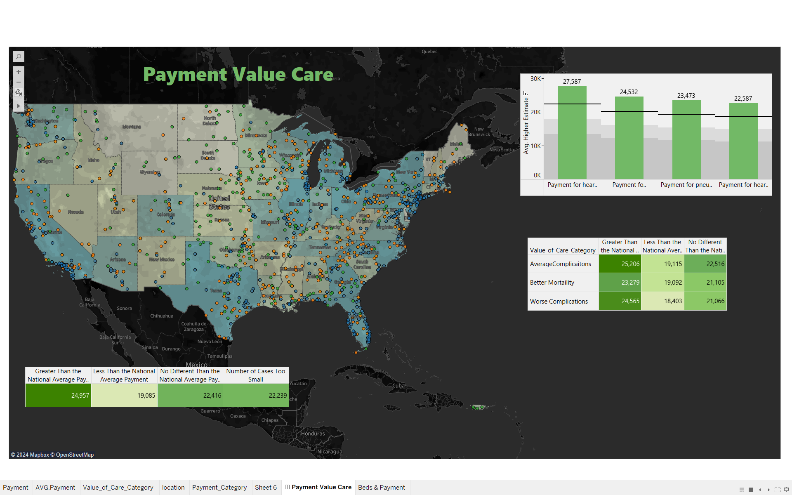
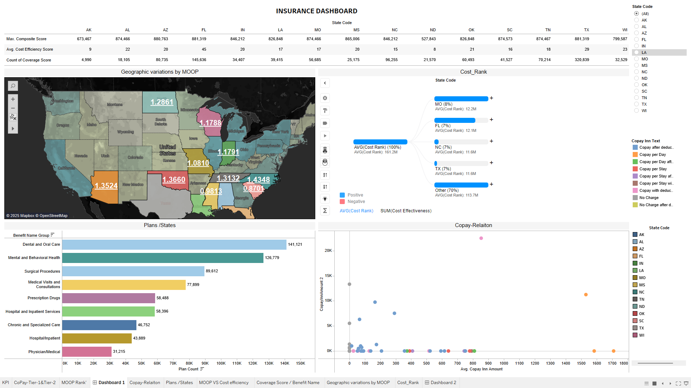

---

# **Healthcare Price Tool**

### **Overview**  
The **Healthcare Price Tool** is a data-driven application designed to help patients, insurers, and policymakers make informed decisions about healthcare costs and insurance plans. By analyzing datasets like **Payment-Value-Care**, **Benefits Cost Share PUF**, and **NASHP**, the tool provides actionable insights into cost-efficiency, benefit coverage, and regional variations in healthcare affordability.  

---

### **Motivation**  
Healthcare costs have risen dramatically, leaving patients with limited transparency in selecting affordable and quality care. This project aims to bridge that gap by:  
- Comparing hospital payments and value-based care metrics.  
- Analyzing insurance plans based on copayments, deductibles, and maximum out-of-pocket (MOOP) costs.  
- Recommending cost-efficient plans and hospitals based on user-specific needs.  

---

### **Objectives**  
1. Identify cost-efficient insurance plans based on financial priorities.  
2. Highlight hospitals providing high-quality care at competitive costs.  
3. Provide insights into regional variations in healthcare costs and coverage.  
4. Develop a predictive model for healthcare costs and quality metrics.  

---

### **Data Sources**  
The tool integrates data from multiple sources:  
- **Payment-Value-Care Dataset**: Hospital-level cost and value-based care metrics.  
- **Benefits Cost Sharing PUF**: Insurance plan details, including copayments, coinsurance, and service limits.  
- **NASHP Dataset**: Comprehensive hospital data for regional and operational insights.  

---

### **Features**  
- **Cost Analysis**: Compare payments, deductibles, and MOOP costs across regions and benefit types.  
- **Geographic Insights**: Visualize regional variations in healthcare affordability.  
- **Plan Comparisons**: Evaluate insurance plans based on benefit coverage and financial efficiency.  
- **Predictive Modeling**: Machine learning models to predict healthcare costs and identify cost-efficient options.  
- **Interactive Dashboards**: Tableau dashboards for exploring data and insights interactively.  

---

### **EDA Highlights**  
Key exploratory data analysis conducted:  
- **Descriptive Statistics**: Summarized copayments, coinsurance rates, and MOOP trends.  
- **Geographical Analysis**: Examined regional disparities in healthcare costs.  
- **Correlation Analysis**: Explored relationships between benefit types, costs, and coverage.  
- **Category Insights**: Identified trends in benefit inclusion and service limits.  

---
## Dashboard Previews  
### Payment Value Care Dashboard  
  

### Benefits Cost Sharing Dashboard  

---

### **Insights**  
1. **Cost Variations Across States**:  
   - States like **Florida** and **Texas** exhibit higher MOOP values, indicating increased financial risk for residents.  
   - Northern states like **South Dakota** offer more affordable healthcare plans with lower MOOP values.  

2. **Benefit Gaps**:  
   - While **Dental and Mental Health services** are commonly covered, **chronic care services** and **vision benefits** are often excluded or limited.  

3. **Affordability Trade-Offs**:  
   - Plans with lower premiums often come with higher deductibles or coinsurance rates, making them suitable for low-frequency healthcare users.  
   - PPO plans, while flexible, tend to have higher MOOP and premiums compared to HMOs.  

4. **High-Cost Drivers**:  
   - **Emergency care** and **inpatient services** are the most significant contributors to copay and MOOP increases.  

---

### **Recommendations**  
1. **For Patients**:  
   - Opt for plans with lower MOOP if you anticipate high medical expenses or chronic care needs.  
   - For preventative care or occasional visits, choose high-deductible health plans (HDHPs) with lower premiums.  

2. **For Insurers**:  
   - Introduce plans with broader coverage for chronic care and vision services to address unmet needs.  
   - Consider regional trends and demographics when designing plans to improve accessibility and competitiveness.  

3. **For Policymakers**:  
   - Focus on reducing MOOP disparities across states by introducing subsidies or regulating costs in high-risk regions.  
   - Encourage insurers to offer comprehensive Essential Health Benefits (EHBs) without restrictive caps.  

---

### **Technologies Used**  
- **Python**: Data preprocessing, EDA, and predictive modeling.  
- **Tableau**: Interactive dashboards for data visualization.  
- **Pandas & NumPy**: Data manipulation and statistical analysis.  
- **Scikit-learn**: Machine learning model development.  
- **Selenium/BeautifulSoup**: Web scraping for real-time updates (if applicable).  

---

### **Key Dashboards**  
1. **Payment-Value-Care Dashboard**:  
   - Displays hospital payment metrics and value-based care insights.  
   - Provides state-wise MOOP variations and hospital performance.  

2. **Benefits Cost Sharing Dashboard**:  
   - Compares insurance plans based on cost-sharing structures.  
   - Highlights exclusions, service limits, and regional plan variations.  

---

### **Challenges and Solutions**  
1. **Data Integration**: Combined datasets with inconsistent formats and missing values using robust preprocessing techniques.  
2. **Outliers**: Handled outliers in payment and MOOP data using IQR methods to ensure analysis integrity.  
3. **Ethical Considerations**: Ensured compliance with data privacy regulations by using publicly available datasets.  

---

### **Future Work**  
- Add real-time data scraping for updated insights.  
- Expand predictive modeling to include demographic and seasonal trends.  
- Enhance dashboards with more granular filters for user-specific analysis.  

---

### **How to Use**  
1. Clone the repository:  
   ```bash
   git clone https://github.com/your-username/healthcare-price-tool.git
   ```  
2. Install dependencies:  
   ```bash
   pip install -r requirements.txt
   ```  
3. Run the analysis script:  
   ```bash
   python main.py
   ```  
4. Explore the Tableau dashboards for interactive visualizations.

---

### **Contributors**  
- **Samboju Prakash Tejashwani**: Team Lead  
- **Nitesh Sein**: Data Engineer  
- **Darshan Mangukiya**: Data Scientist  
- **Nithin Arumbakam Nagaraju**: Data Scientist  
- **Soyinka Oluwaseun**: Stakeholder/QA  

---

### **License**  
This project is licensed under the MIT License.  

---

### **Acknowledgments**  
Special thanks to the National Academy for State Health Policy (NASHP) and Centers for Medicare & Medicaid Services (CMS) for providing publicly available datasets.  

--- 

